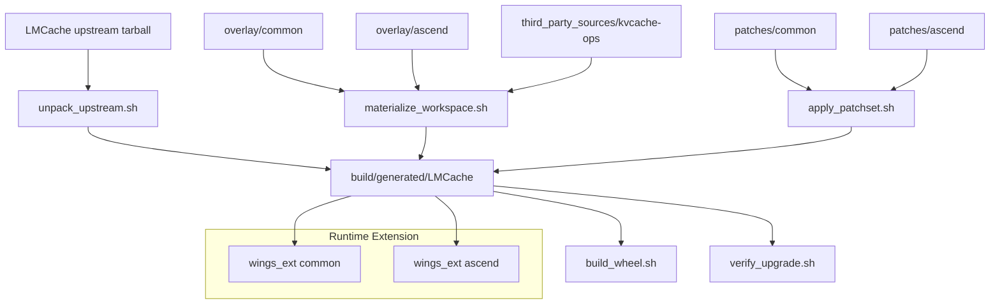
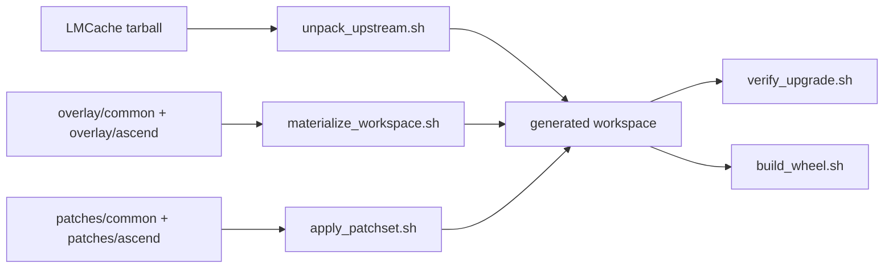
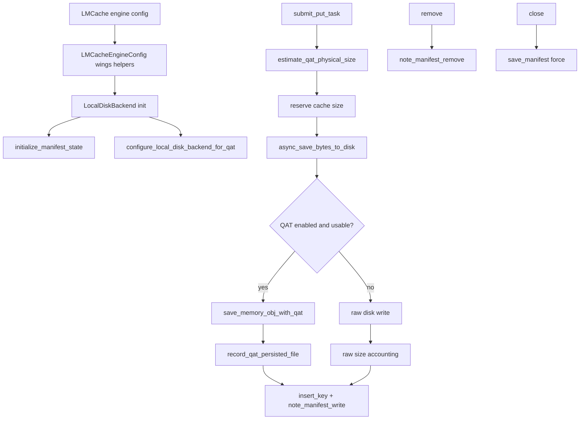
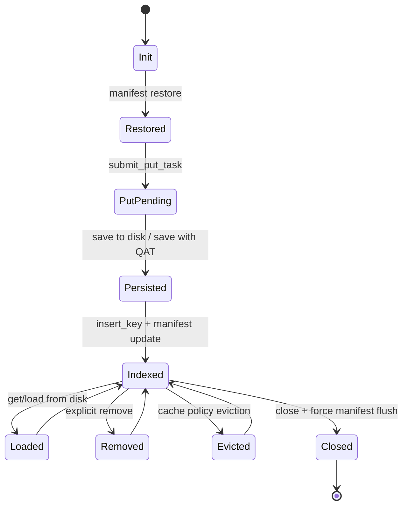
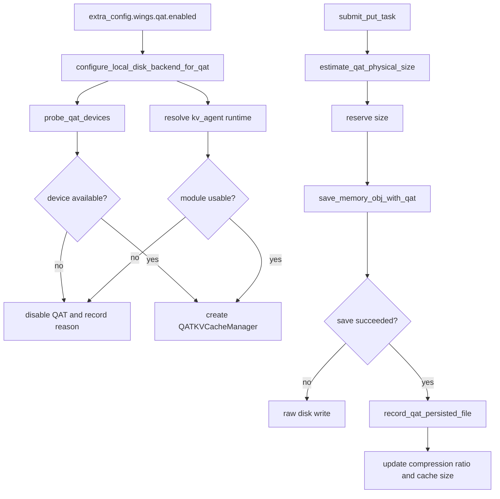
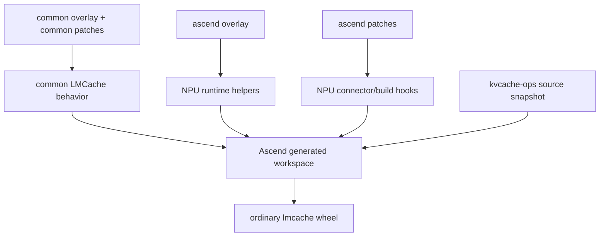

# LMCache Patch-First 开发设计文档

## 1. 文档目的

本文档描述 `wings-accel/LMCache_patch` 当前针对 LMCache 的源码级适配设计。

文档目标是说明：

- 为什么采用当前的 patch-first / offline source snapshot 设计
- 当前 `US-KV1 ~ US-KV4` 能力分别落在哪些层
- common 与 ascend 两条路径如何复用与分层
- 构建、重放、运行时三条主流程如何协同
- 当前设计边界、关键取舍和后续扩展点

本文档是开发设计文档，不是交付说明文档，也不以“已完成事项罗列”为主。

## 2. 需求对齐

当前设计按以下需求主链组织：

- `P0 / US-KV1`: 冷加载
- `P1 / US-KV2`: 磁盘生命周期管理
- `P2 / US-KV3`: QAT 压缩，包含 ARM 降级
- `P3 / US-KV4`: Ascend NPU 设备支持，复用 `US-KV1 + US-KV2`，不支持 `US-KV3`

另外，当前仓库中仍保留两条附加能力：

- `maintenance`
- `full_sync`

这两条能力不属于当前主交付链，但设计上仍以 overlay + hook patch 方式保留。

## 3. 设计目标与约束

### 3.1 设计目标

- 保持上游 LMCache 源码基线尽可能干净
- 让 Wings 自有逻辑与上游逻辑解耦，便于升级 LMCache 版本
- 支持离线源码输入，不依赖 `git clone` 上游 LMCache
- 支持平台分层：`common` 与 `ascend`
- 让 `P0/P1/P2` 尽可能汇聚到同一条 local-disk 数据路径上
- 让 `P3` 在复用 `common` 的前提下，只增加 NPU 平台差异

### 3.2 关键约束

- 上游 LMCache 输入以 tarball 为准，不直接把工作树作为长期维护源
- 构建应从一次性 generated workspace 进行，而不是在源码镜像目录上长期改
- QAT 在 common 路径下是 optional feature，不应绑死 LMCache 主 wheel 构建
- Ascend 路径显式禁止 QAT

## 4. 总体架构

### 4.1 目录职责

- `manifest/`: 锁定上游 LMCache 与额外源码快照元信息
- `upstream_sources/`: LMCache 上游 tarball 输入
- `third_party_sources/`: 平台附加源码输入，如 `kvcache-ops`
- `overlay/common/`: Wings 自有通用代码
- `overlay/ascend/`: Ascend 平台专属代码
- `patches/common/`: 通用 hook patch
- `patches/ascend/`: Ascend 平台 patch
- `scripts/`: unpack / materialize / apply / build / verify 工作流脚本
- `build/generated/LMCache`: 一次性生成工作区

### 4.2 架构分层图

### 4.3 核心设计思想

当前设计不是维护一个“改脏的 LMCache 分叉树”，而是维护三类资产：

- 干净的上游源码快照
- Wings 自有 overlay 代码
- 对上游最小化的 hook patch

这样做的主要原因是升级成本控制：

- 大块业务逻辑尽量留在 overlay 中，升级时不必反复 rebase
- 上游文件只保留薄胶水修改，patch 冲突面更小
- 平台差异通过分层表达，而不是复制整棵源码树

## 5. 源码输入与构建设计

### 5.1 Source of Truth

LMCache 的真实输入不是 git 仓库，而是 `manifest/lmcache.lock.json` 锁定的 tarball：

- `version`
- `tarball_name`
- `tarball_sha256`
- `root_dir_name_in_tar`
- `patchset_version`

Ascend 附加依赖 `kvcache-ops` 也采用同样思路：

- 本地开发环境使用离线 tarball
- 公司内网可通过显式预处理脚本从内部 Git 拉取后转为受 lock 控制的源码快照

### 5.2 离线重放流程

### 5.3 为什么 generated workspace 是必要的

generated workspace 的作用是把“源码输入”和“构建工作区”分离：

- tarball 内容保持原样，可复现、可校验
- overlay 与 patch 都只落在临时工作区
- `verify_upgrade` 可以反复 replay，不污染源码输入
- 版本升级时只需要替换 tarball、更新 lock、修 patch

## 6. 配置模型设计

Wings 的适配配置统一收口到 `extra_config.wings`。

上游 `LMCacheEngineConfig` 通过 `0001-config-hooks.patch` 扩展出三类 helper：

- `get_wings_config()`
- `get_wings_feature_config(feature_name)`
- `is_wings_feature_enabled(feature_name)`

这样各能力模块不需要直接依赖上游配置结构细节，只需要消费 feature-level 配置。

设计意图：

- 避免在各处散落 `extra_config["wings"]` 的读取逻辑
- 让 overlay 模块与上游 config 对接点最小化
- 后续新增 feature 时仍可沿用相同扩展机制

## 7. Common 路径设计

### 7.1 核心汇聚点：LocalDiskBackend

当前 `P0 / P1 / P2` 的主数据路径都汇聚在 `LocalDiskBackend`。

原因是：

- 冷加载的恢复与落盘元数据天然属于 local-disk 语义
- 生命周期管理本身就是 local-disk backend 的职责边界
- QAT 压缩发生在磁盘保存/读取路径上，天然也应挂在 local-disk backend

因此当前设计不是三套完全独立 patch，而是：

- 用一条通用 patch 改造 `LocalDiskBackend`
- 在其中接入 cold_start hooks
- 接入 QAT hooks
- 同时保留上游 eviction / async save/load 主结构

### 7.2 Common 运行时主路径图

## 8. P0 / US-KV1 设计

### 8.1 设计目标

`US-KV1` 的目标是在 LMCache 重启后恢复 local-disk 上的缓存索引，而不是重新扫描和推断全部运行时元信息。

### 8.2 当前方案

当前采用 manifest-based 方案：

- 写入或删除缓存项时，更新 manifest 状态
- backend 关闭时强制 flush manifest
- backend 初始化时，从 manifest 恢复 dict / metadata / usage

### 8.3 为什么不用旧的 file-scan 方案

当前设计刻意不沿用旧的“扫描文件 + 推断元信息”的方式，原因是：

- 推断逻辑依赖更多隐式约束
- 恢复时更脆弱，容错边界不清晰
- 对升级和平台复用不友好

manifest 的优点是：

- 恢复边界清晰
- 元信息完整
- 容易做 storage path 校验、payload 存在校验、版本校验

代价是：

- 需要维护 manifest 一致性
- 对 manifest 文件损坏没有完整 salvage 机制

## 9. P1 / US-KV2 设计

### 9.1 需求边界

本文将 `US-KV2` 定义为 `LocalDiskBackend` 的完整生命周期管理：

- init
- put
- get/load
- remove
- eviction
- close
- usage / cache-size accounting

### 9.2 设计原则

- 不重写上游 backend 主流程
- 只在生命周期关键点插入 Wings hook
- 保持与 cold start / QAT 的兼容

### 9.3 生命周期设计图

### 9.4 当前设计取舍

当前 `US-KV2` 更强调“把 lifecycle hook 接正确”，而不是自己替换上游 cache policy / executor / storage backend 结构。

这意味着：

- 上游 eviction 仍以原生逻辑为主
- Wings 负责把 metadata、usage、manifest、QAT accounting 衔接好
- 后续如果要增强生命周期行为，优先继续走 hook-first，而不是复制 backend 实现

## 10. P2 / US-KV3 设计

### 10.1 目标

`US-KV3` 的目标不是把 QAT 变成 common 路径的强依赖，而是在满足条件时提供压缩能力，不满足条件时优雅退化。

### 10.2 运行时设计

QAT 运行时由三部分组成：

- `qat/hooks.py`
  负责 feature gate、设备探测、runtime 可用性判断、backend 侧 helper
- `qat/manager.py`
  负责与 `kv_agent` 交互、memory format 适配、持久化大小读取、压缩比跟踪
- `LocalDiskBackend` hook patch
  负责把 save/load 与容量预估接回 backend 主流程

### 10.3 QAT 数据路径

### 10.4 ARM 降级设计

当前设计明确将 QAT 定义为 optional feature：

- `build-wheel` 在 common 路径下只“尝试”构建 `kv-agent`
- 如果主机是 `aarch64/arm64`，默认跳过 `kv-agent`
- 如果缺少 QAT toolchain、headers、shared libs，也默认跳过
- 即使 `kv-agent` 被跳过，LMCache 主 wheel 仍继续构建

这个设计的意图是：

- 保证 common 路径的可构建性
- 把 QAT 从“硬依赖”降级为“增强能力”
- 让 ARM 平台默认走 raw local-disk 路径，而不是构建失败

保留的严格模式开关：

- `WINGS_STRICT_QAT_BUILD=1`

在该模式下，optional build skip 会重新变成 hard failure。

## 11. P3 / US-KV4 设计

### 11.1 目标

`US-KV4` 的目标不是复刻一个独立的 `LMCache-Ascend` 分叉，而是在普通 LMCache 包线上复用 `US-KV1 + US-KV2`，再叠加 NPU 平台能力。

### 11.2 平台分层原则

- `common` 层承载通用逻辑：cold start、local-disk lifecycle、QAT runtime、附加能力
- `ascend` 层只承载 NPU 特有内容：runtime helper、connector、csrc、build hook、QAT 禁止规则

即：

- Ascend 复用 common 的 `P0/P1`
- Ascend 不复用 common 的 `P2`
- Ascend 通过显式 patch 禁止 `P2`

### 11.3 Ascend 架构图

### 11.4 Ascend 运行时设计

Ascend 路径增加的关键能力有：

- runtime accelerator 检测，支持返回 `npu`
- backend dst-device 解析，支持 NPU
- vLLM connector 选择 NPU connector
- `torch_npu.contrib.transfer_to_npu` 兼容入口
- `kvcache-ops` + `lmcache.c_ops` 的构建与打包

当前设计明确限制：

- 只支持第一版 non-layerwise NPU connector 主路径
- layerwise / blending / 更广 layout 覆盖仍未做完
- QAT 在 NPU 上显式不支持

## 12. 附加能力设计

虽然 `maintenance` 和 `full_sync` 不属于当前主需求链，但它们仍沿用同一设计方法：

- 功能主体写在 `overlay/common/lmcache/v1/wings_ext/...`
- 对上游只保留薄 patch
- 能不改核心文件结构就不改

这体现了当前仓库统一的扩展思路：

- 新能力优先 overlay
- 上游只做 hook point 接入

## 13. 关键设计取舍

### 13.1 选择 patch-first，而不是长期维护 fork

优点：

- 升级 LMCache 时冲突面小
- Wings 自有逻辑边界清晰
- common / ascend 容易分层

代价：

- patch 与 overlay 之间需要保持纪律
- 生成工作区调试路径比直接改源码树多一步

### 13.2 选择 manifest-based cold start，而不是 file-scan

优点：

- 恢复语义稳定
- 元信息完整
- 生命周期可控

代价：

- 依赖 manifest 一致性
- manifest 损坏时没有完整自修复

### 13.3 选择 optional QAT，而不是 hard dependency

优点：

- common wheel 可在更多环境构建
- ARM 路径天然可降级
- QAT 不再成为主流程阻塞点

代价：

- 构建产物可能不总是带 `kv_agent` wheel
- 需要额外的硬件验证来证明增强路径正常

### 13.4 选择 common + ascend 分层，而不是独立 LMCache-Ascend

优点：

- `US-KV1 + US-KV2` 可以直接复用
- 平台差异显式、边界清晰
- 避免再次形成独立分叉产品线

代价：

- Ascend patch 必须严格控制在平台差异范围内
- 当前尚未覆盖全部 NPU 特性分支

## 14. 后续扩展点

当前设计下，后续最自然的扩展方向有：

- 为 `US-KV2` 增加 eviction-focused 生命周期测试
- 为 `US-KV3` 增加真实 QAT 硬件 smoke 和 validator tooling
- 为 `US-KV4` 扩大 NPU connector 的 layout / layerwise 覆盖
- 在不改变 patch-first 基础模型的前提下继续扩新 feature

## 15. 非目标

当前设计明确不追求：

- 在仓库里长期维护一个上游 LMCache 的改造分叉树
- 把 QAT 变成 common wheel 的硬依赖
- 让 Ascend 路径支持 QAT
- 一次性复刻旧 `LMCache-Ascend` 的全部历史 hack

## 16. 总结

当前 `LMCache_patch` 的核心设计可以概括为：

- 用 tarball 锁定源码输入
- 用 overlay 承载 Wings 自有逻辑
- 用小 patch 把 hook 接回上游
- 用 generated workspace 重放构建
- 用 `common + ascend` 分层表达平台差异

在这个框架下：

- `US-KV1` 和 `US-KV2` 已经形成稳定主路径
- `US-KV3` 已经接上核心链路，并具备 ARM / 缺依赖降级能力
- `US-KV4` 已经建立第一版 NPU 运行时与构建骨架，但仍需要真实硬件闭环

这套设计的重点不是“把所有逻辑塞进 patch”，而是把变更分配到最合适的层：配置扩展、运行时 overlay、平台 overlay、薄 hook patch、离线构建脚本，各司其职。
