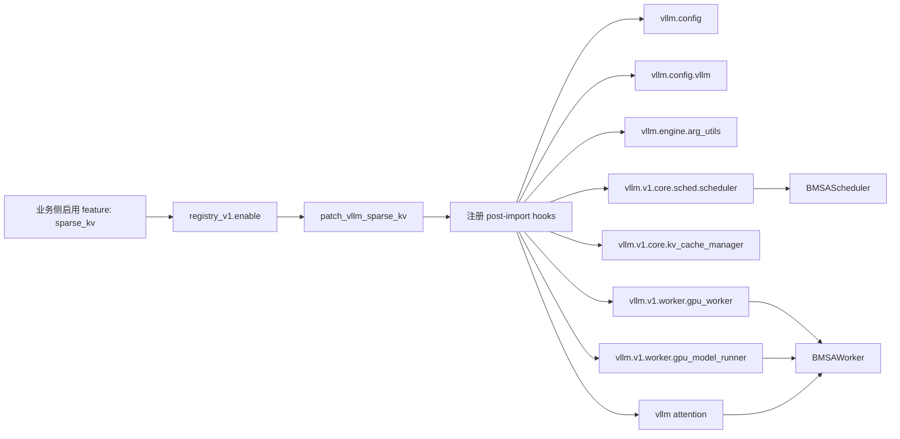
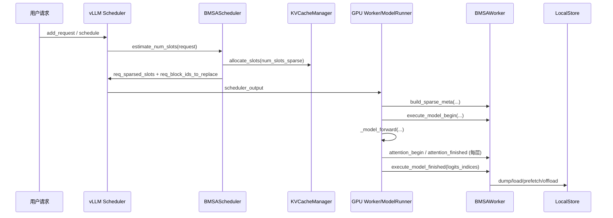
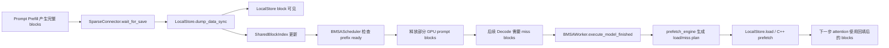

# Sparse KV 开发设计文档

本文基于 `wings-accel` 当前 sparse kv 实现整理，目标是把 `wings/sparsekv` 的 BMSA 方案迁移到 `wings-accel` 的 monkey-patch 框架、并适配 `vLLM v0.17.0` 的设计思路、模块职责、关键语义和当前实现状态。当前实现的核心目标是：在尽量保留 `vsparse` 算法主体的前提下，让 `LocalStore + BMSA prefetch + paged-kmeans + offload` 在 v1 runtime 中可工作、可测试、可继续推进到生产可用。

## 1. 背景与范围

### 1.1 背景

- 老版本参考系是 `/workspace/vLLM`，对应旧的 `vLLM v0.12.0` 代码和原始 sparse patch 语义。
- 新版本运行目标是 `/workspace/vllm`，对应 `vLLM v0.17.0`。
- `wings-accel` 不再直接改 vLLM 源码，而是通过 `wings_engine_patch` 在 import 时对 vLLM 做 monkey-patch。
- `sparsekv/` 目录以 `vsparse` 包名提供算法本体、connector、native extension、测试与兼容层。

### 1.2 迁移范围

本次迁移关注四件事：

1. 把 `vsparse/BMSA` 算法主体带到 `wings-accel`。
2. 把原来依赖 vLLM 源码 patch 的行为，改为 `wings_engine_patch` 的 post-import monkey-patch。
3. 适配 `vLLM v0.17.0` 的 v1 runtime 生命周期与接口变化。
4. 补齐 LocalStore、兼容导入路径、测试与稳定性修复。

### 1.3 非目标

- 不重写 BMSA 核心算法。
- 不重写 native `offload_ops / prefetch_engine / paged_kmeans`。
- 不在本轮引入新的 sparse 算法类型，当前只聚焦 `BMSA`。

## 2. 方案形成与设计目标

当前方案的形成可以概括为一条连续的工程收敛链路。

首先，需要把原 `wings/sparsekv` 中已经存在的算法能力完整带入 `wings-accel`，包括 `vsparse` 包、BMSA、paged-kmeans、prefetch、connector、LocalStore、native extension 以及对应测试骨架。这样做的目的，是先保证新仓库具备完整的 sparse kv 代码底座，避免迁移过程中同时发生“能力缺失”和“运行时适配”两类问题。

在此基础上，第二步是把 sparse kv 从“仓库内存在的一套算法实现”变成“可以被 `vLLM v0.17.0` 正式启用的运行时能力”。这要求通过 `wings_engine_patch` 将 sparse 配置和执行逻辑挂到 `vllm.config`、`EngineArgs`、`Scheduler`、`KVCacheManager`、`Worker`、`GPUModelRunner` 和 attention hook 所构成的主执行链路上，使 sparse kv 不再依赖手改 vLLM 源码，而是作为 `wings-accel` 的标准 feature 接入 v1 runtime。

最后，方案演进的重点转向关键语义对齐和生产可用性补强。这里包括：校正 `GPUModelRunner.execute_model` 的插桩时机，使 `execute_model_begin` 和 `execute_model_finished` 处于正确的 forward 作用域内；补齐 `EngineArgs(sparse_config=...)` 这类程序化入口；完善 `SchedulerOutput` 中与 block replacement 相关的元数据；让 `LocalStore` 支持同步 dump，以保证首个 decode step 的可见性；同时恢复历史导入路径并补上专项测试。经过上述补强，方案的重点就从“能接入运行时”进一步提升为“关键行为与原语义一致、兼容层完整、具备持续验证和工程化推进的基础”。

## 3. 总体设计原则

### 3.1 原则一：算法本体尽量不动，迁移重点放在 runtime 接缝

`vsparse` 内部的 BMSA 调度、prefetch、offload、paged-kmeans、LocalStore、本地 native 能力整体保留。真正需要重做的是：

- vLLM 配置注入方式
- Scheduler/Worker/ModelRunner 的生命周期挂点
- v1 runtime 的 block table、slot mapping、attention metadata 语义
- 兼容层、导包路径、测试与安装打包

### 3.2 原则二：monkey-patch 只补“语义缺口”，不复制整个 vLLM

如果 vLLM 现有行为能直接复用，就尽量 patch 局部方法。

只有在 `GPUModelRunner.execute_model` 这种必须精确插桩的位置，才按 v0.17.0 当前实现做“受控复刻”，确保 sparse begin/finished 的时机与旧 patch 等价。

### 3.3 原则三：优先保证正确性，再做性能优化

典型例子有两个：

- LocalStore dump 从异步切到支持同步提交，以保证首个 decode step 能看到 prompt blocks。
- Shared index readiness probe 从 `(8, 32, 64)` 收敛到 `(0, 8, 32, 64)`，先保证语义及时一致，再考虑更细的优化。

## 4. 总体架构

### 4.1 模块分层

| 层次 | 模块 | 职责 |
| --- | --- | --- |
| Feature 注册层 | `wings_engine_patch/registry_v1.py` | 向 `vllm@0.17.0` 暴露 `sparse_kv` feature |
| Patch 接入层 | `patch_vllm_container/v0_17_0/sparse_kv_patch.py` | 在 import 后 patch vLLM 的 config、scheduler、worker、attention、model_runner |
| 配置层 | `sparse_kv_config.py` | 定义 `SparseConfig / BMSAConfig / LayerSparsePolicy` |
| 算法工厂层 | `vsparse.core.*` | 注册和创建 `BMSAScheduler / BMSAWorker` |
| 调度层 | `vsparse.bmsa.sche_agent` | 估算 sparse slots、释放 prompt blocks、与 shared index 联动 |
| Worker 执行层 | `vsparse.bmsa.worker_agent` | 构造 metadata、准备 topk/kpre、执行 attention hook、驱动 prefetch/offload |
| 元数据层 | `vsparse.bmsa.types` | 管理 request 级状态和 step 级 model_input |
| 存储层 | `vsparse.connectors.*`, `vsparse.connectors.localstore_connector` | 外部 block lookup/load/dump、LocalStore 存储与 shared index 管理 |
| Native 层 | `vsparse.native.*` | `offload_ops`、`prefetch_engine`、`paged_kmeans`、`kvstore` |

### 4.2 Patch 激活链路



### 4.3 稀疏运行时主链路



## 5. 配置与初始化设计

### 5.1 配置对象注入

`sparse_kv_patch.py` 会把三类配置对象注入 `vllm.config` 命名空间：

- `SparseConfig`
- `BMSAConfig`
- `LayerSparsePolicy`

这样做的目的不是改 vLLM 源码，而是让 vLLM 运行时可以像原生类型一样感知 sparse 配置。

### 5.2 VllmConfig 兼容设计

patch 对 `vllm.config.vllm.VllmConfig` 做两件事：

1. 在 `__init__` 中额外接收 `sparse_config`
2. 在 `__post_init__` 结束后执行 `sparse_config.finalize(self)`

这一层保证了 sparse 配置可以真正落到 vLLM 主配置对象上，并在模型/并行/缓存参数就绪后完成最终收敛。

### 5.3 EngineArgs 兼容设计

这是当前方案中的关键兼容点之一。

当前 patch 同时支持三种入口：

1. CLI: `--sparse-config`
2. 程序化构造: `EngineArgs(..., sparse_config=...)`
3. `create_engine_config()` 透传到 `VllmConfig`

这一设计解决的是 v0.17.0 场景下“CLI 可用，但直接构造 EngineArgs 不可用”的缺口。当前策略是不改 dataclass 元数据，只补足运行时语义。

## 6. 算法实例化设计

`vsparse.core.factory.SparseAlgorithmFactory` 统一注册 sparse 算法，当前只注册：

- `BMSA -> vsparse.bmsa.BMSAScheduler + vsparse.bmsa.BMSAWorker`

在 patch 后：

- `Scheduler.__init__` 会初始化 scheduler 侧 agent
- `Worker.initialize_from_config` 会初始化 worker 侧 agent

同一进程中如果既有 scheduler 又有 worker，也允许两个 role 共存，避免单机单卡场景下的歧义。

## 7. Scheduler 侧设计

### 7.1 触发条件

`BMSAScheduler.estimate_num_slots()` 只有在以下条件都满足时才返回有效 sparse slots：

1. `ptopk_prefetch_enable=True`
2. 请求已经进入 decode，`num_output_tokens > 0`
3. prompt 至少大于一个 block
4. `num_prompt_tokens > lc_sparse_threshold`

否则返回 `INVALID_SLOT=-1`，即维持 dense 分配。

### 7.2 slot 估算逻辑

调度层的目标不是决定“精确 topk block 是哪些”，而是估算“GPU 上至少要保留多少 slots”。

估算公式大意是：

- prompt block 中保留 `Top-K + prefetch blocks`
- decode 产生的新 block 都保留
- 其余 prompt block 可以被回收，后续通过外部 store 召回

这一步的输出通过 patch 注入到 `SchedulerOutput`：

- `req_sparsed_slots`
- `req_block_ids_to_replace`

其中 `req_block_ids_to_replace` 是当前调度-执行协同中的关键元数据，表示这个请求的 block table 需要被“替换”而不是“追加”。

### 7.3 allocate_slots 的 v0.17.0 适配

v0.17.0 的 block allocator 接口相比老版本更严格，当前实现已经适配：

- `coordinator.get_num_blocks_to_allocate(..., total_computed_tokens, num_tokens_main_model)`
- `coordinator.allocate_new_blocks(..., num_tokens_main_model=...)`

这部分是适配 v0.17.0 allocator 接口的必要改造。

### 7.4 SharedBlockIndex 协同释放

调度侧不会盲目释放 prompt blocks，而是先检查 shared index 中对应 block 是否已经可见。

当前策略：

- prefill 刚结束后的第一次 decode 分配立即检查
- 后续按 `(0, 8, 32, 64)` 次分配回退式重试
- 只有当 prompt prefix blocks 在 shared index 中全部 ready，才允许释放对应 GPU blocks

这一步的核心意义是：避免 scheduler 过早进入 sparse 布局，而 worker/store 还没完成 dump，导致 block table 与可召回数据不一致。

## 8. Worker 侧设计

### 8.1 Worker 生命周期职责

`BMSAWorker` 的职责可以拆成四段：

1. `build_sparse_meta`
2. `execute_model_begin`
3. `attention_begin / attention_finished`
4. `execute_model_finished`

其中：

- `build_sparse_meta` 负责把 scheduler output、cached request state、input batch 组装成 BMSA 可消费的 step 级输入
- `execute_model_begin` 负责让 prefetch/topk/kpre 运行前的状态就绪
- `attention_*` 负责在每层 attention 执行期间切换 sparse block table，并更新 topk/kpre 相关缓存
- `execute_model_finished` 负责在 step 结束后触发下一步 prefetch/offload

### 8.2 build_sparse_meta 设计

`BMSAMetadata.get_model_input()` 是 worker 侧状态胶水层。

当前实现有两个关键处理点：

1. 先处理 `scheduled_new_reqs`，再处理 `scheduled_cached_reqs`
2. 对“第一次以 cached_reqs 身份出现，但历史上未注册过”的请求做兜底注册

这两个点修复的是 v1 runtime 下 chunked prefill 的时序差异，否则 `bmsa_stats` 会出现缺项。

### 8.3 execute_model_begin 设计

这一步主要做三件事：

1. 把当前 batch 的 request/block table/topk-kpre map 交给 `prefetch_engine.model_input_deal`
2. 同步 `bmsa_stats` 与 step 内 `model_input`
3. 启动本 step 需要的 topk 计算

对于 block-mean 路径，会走 `copy_q + offload_ops`。

对于 paged-kmeans 路径，会把 decode query 送到 centroid pool / cluster index 相关流程里，产出每层 topk block indices。

### 8.4 attention_begin 设计

这是 worker 侧真正把 dense attention 改成 sparse attention 的关键点。

每层 attention 前会：

1. 把 `attn_metadata.block_table` 替换成 BMSA 生成的稀疏 block table
2. 把 `seq_lens / max_seq_len` 替换成稀疏后的长度
3. 关闭 dense cascade attention 元数据

关闭 dense cascade metadata 是当前实现中的关键约束之一。原因很直接：

- sparse block table 已经不再等价于 dense prefix planner 的输出
- 如果继续复用 dense cascade metadata，长上下文 decode 时会把稀疏 block table 和旧的 prefix 规划混在一起，导致行为错误

### 8.5 attention_finished 设计

attention 后做两类事：

1. 常规路径下更新 `kpre`/`k cache mean` 等 topk 相关中间量
2. 如果当前请求处于 prompt 的最后一个 chunk，则执行首轮 topk 初始化

block-mean 路径里：

- 用最后一个 query 对 prompt blocks 做 topk 选择
- 根据 topk 结果构造 `remain_map / prefetch_map`
- 直接在 KV cache 上做 block move，使“保留块”与“待预取块”落到新的稀疏布局

paged-kmeans 路径里：

- 在 prefill 完成后启动 per-layer 聚类
- 将 query 和 cluster topk 结果暂存，等待后续 decode 消费

### 8.6 execute_model_finished 设计

模型 step 结束后会：

1. 收集每层 `kv_cache`
2. 如果启用 paged-kmeans，先收尾 prefill 阶段的聚类结果
3. 如果启用 prefetch，则驱动下一步异步 prefetch

这里支持两种装载模式：

- C++ prefetch 模式：直接把 `store.cc_store()` 指针传给 prefetch engine
- Python load 模式：由 prefetch engine 先给出 load/miss plan，再从 Python 调 `store.load(...)`

## 9. GPUModelRunner 迁移设计

这是整个迁移中最敏感的一层。

### 9.1 patch 范围

当前 patch 会改三块：

1. `_update_states`
2. `_prepare_inputs`
3. `execute_model`

### 9.2 `_update_states` 设计

如果仅采用“先调用原函数、再补做修正”的方式，这一层很难保证 block table 和 request state 的语义始终一致。

现在的实现改成了更接近原 patch 语义的完整重写，关键点是：

- 对 finished requests 通知 worker agent 做回收
- 对 sparse 请求，block ids 要按 replacement 语义处理，而不是 append
- 如果请求被标记进 `req_block_ids_to_replace`，则先 `reset_row()` 再 `append_row()`

这解决了 v1 runtime 下“调度层已经压缩 block 布局，但 input batch/block table 仍按 dense append 语义更新”的问题。

### 9.3 `_prepare_inputs` 设计

对 sparse request，`_prepare_inputs` 需要同时保留两套语义：

- token lookup 仍按真实位置进行
- slot mapping / seq_lens 则要按 sparse 后的位置计算

因此当前实现区分了：

- `positions_np`: 真实 token 位置
- `sparsed_positions_np`: 稀疏布局下用于 slot mapping 的位置
- `true_seq_lens_np`: 真实 seq len，用于 discard mask 等逻辑
- `self.seq_lens`: 稀疏后的 seq len，用于 attention metadata

这一步保证了“采样/请求状态”仍看真实长度，而“attention 访存”看稀疏布局。

### 9.4 `execute_model` 设计

这是当前设计中最关键的执行约束之一。

初版 patch 采用的是“包一层 `_model_forward` + cleanup”思路，但这无法完整复刻旧 patch 中：

- `execute_model_begin` 必须在 `set_forward_context(...)` 作用域内执行
- `execute_model_finished(logits_indices)` 必须在 `_model_forward(...)` 之后、postprocess 之前执行

当前实现策略是：

- 单测/假 runner 场景走 fallback wrapper
- 真实 vLLM 0.17.0 路径则按当前 `execute_model` 结构做受控复刻

关键插桩点是：

1. `set_forward_context(...)` 建立后
2. `_model_forward(...)` 调用前执行 `self._maybe_execute_sparse_begin(...)`
3. `_model_forward(...)` 返回后立刻执行 `logits_indices = self._maybe_execute_sparse_finished(logits_indices)`
4. 若 forward 中异常退出，则保证 `clear_sparse_metadata()` 仍执行

这保证了与原 patch 最重要的两条语义对齐：

- sparse metadata 进入 attention 时已经绑定
- logits 采样使用的是 sparse finished 后的 `logits_indices`

### 9.5 相关流程图

```mermaid
flowchart TD
    A[scheduler_output 进入 GPUModelRunner] --> B[_update_states]
    B --> C[_prepare_inputs]
    C --> D[_build_attention_metadata]
    D --> E[set_forward_context]
    E --> F[execute_model_begin / bind sparse meta]
    F --> G[_model_forward]
    G --> H[execute_model_finished(logits_indices)]
    H --> I[postprocess / sample_hidden_states]
    I --> J[execute_model_state 返回]
```

## 10. Connector 与 LocalStore 设计

### 10.1 SparseConnector 职责

`vsparse.connectors.sparse_connector` 负责两类事情：

1. scheduler 侧：判断 prefix/shared blocks 命中情况
2. worker 侧：load / save KV blocks

### 10.2 scheduler 侧 lookup 设计

当前命中判断保留了“连续前缀命中”的原始语义，但增加了 TP 感知：

- TP=1：直接查 logical block ids
- TP>1：一个 logical block 只有在所有 TP rank 的 shard 都 ready 时才算命中

这样做是因为 scheduler 只有在“所有 rank 都能召回同一逻辑块”时，才可以安全跳过对应 prefill 部分。

### 10.3 resumed 兼容设计

vLLM 不同版本对恢复请求的字段表示不同，当前 connector 兼容：

- `resumed_req_ids`
- `resumed_from_preemption`

这样 `build_connector_meta()` 在不同版本结构下都能正确判断请求是“像新请求一样重新 load”还是“普通 cached request”。

### 10.4 LocalStore 设计

`LocalStoreKVStore` 是 BMSA 的本地 block store，核心能力包括：

- block create / lookup / load / dump
- pin / unpin
- request 级完成回收
- LRU 容量管理
- shared index 协同
- 向 C++ prefetch engine 暴露 `cc_store()`

### 10.5 同步 dump 设计

当前实现增加了 `dump_data_sync()`，并让 worker 侧 `wait_for_save()` 优先使用同步提交。

原因是：

- vLLM 的一步 forward 结束后，调度侧下一次 schedule 很快就会发生
- 如果 prompt blocks 只是“异步排队”而非“真正可见”，scheduler 的 first decode step 仍会看到 dense prompt 布局
- 这会让 scheduler 的 sparse 释放与 worker 的实际 store 可见性错位

同步 dump 本质上是在正确性和时序一致性上兜底。

### 10.6 旧导入路径兼容

为了兼容历史调用，当前保留了两个 shim：

- `vsparse.store.localstore.localstore_connector`
- `vsparse.connector.sparse_connector`

它们都 re-export 新路径实现，避免历史代码或测试在迁移期直接失效。

### 10.7 LocalStore 数据流



## 11. block-mean 与 paged-kmeans 的位置关系

这轮迁移的主线不是重做 topk 算法，而是让两种 topk 实现都能继续挂在统一 runtime 上：

- `topk_type=block-mean`
- `topk_type=paged-kmeans`

两者共享的 runtime 接缝包括：

- `SparseConfig / BMSAConfig`
- Scheduler sparse slots 估算
- `GPUModelRunner` 插桩
- `BMSAMetadata / model_input`
- prefetch/offload/LocalStore

差异主要体现在 worker 侧：

- block-mean 使用 `offload_ops + kpre cache`
- paged-kmeans 额外需要 `CentroidPool / ClusterIndex / Clusterer / RequestHandleAllocator`

所以从迁移设计上看，`wings-accel` 做的是“统一 runtime 外壳”，而不是把两套 topk 算法揉成一套。

## 12. 与 vLLM 0.12.0 的核心差异

从迁移角度，v0.17.0 相比老版本最大的变化不是算法，而是运行时挂点变化。

### 12.1 配置接入方式变化

老版本更多依赖源码 patch；新版本需要通过 post-import hook 把 sparse config 注入 `vllm.config` 和 `VllmConfig`。

### 12.2 v1 runtime 生命周期变化

关键 hook 点变成：

- `Scheduler.schedule`
- `KVCacheManager.allocate_slots`
- `Worker.initialize_from_config`
- `GPUModelRunner._update_states / _prepare_inputs / execute_model`
- `attention.unified_attention`

### 12.3 execute_model 结构更复杂

v0.17.0 的 `execute_model` 引入了更多 batch/cudagraph/spec_decode/encoder connector 相关逻辑，因此 sparse patch 不能再只做一个简单 wrapper，而要精确找到 forward 前后真正需要插桩的位置。

### 12.4 dense cascade metadata 更容易与 sparse 冲突

新 runtime 对 prefix/cascade 的建模更完整，但 sparse attention 使用的是重写后的 block tables，因此必须显式清空 dense cascade 相关字段。

## 13. 测试设计与当前覆盖

### 13.1 当前已补齐的关键单测

`wings_engine_patch/tests/test_sparse_kv_patch.py` 已覆盖：

- `EngineArgs(sparse_config=...)` 程序化构造
- `--sparse-config` 的 JSON / 文件解析
- `GPUModelRunner.execute_model` 中 begin/finished 的调用时机
- `_update_states` 的 replacement 语义
- `SchedulerOutput` 中 sparse 元数据注入
- `BMSAScheduler` first decode readiness probe
- `attention_begin` 对 dense cascade metadata 的清理
- LocalStore legacy shim 导入
- LocalStore 同步 dump 行为

### 13.2 算法包自带测试

`sparsekv/bmsa/tests/` 还带有：

- connector 测试
- paged-kmeans 功能/质量/性能测试
- paged manager 测试
- integration `batch_run.py`

### 13.3 建议继续保持的验证闭环

1. dense vs sparse 输出对比
2. `ptopk_prefetch_enable=True/False`
3. `topk_type=block-mean / paged-kmeans`
4. TP=1 与 TP>1
5. LocalStore offload/prefetch 与 shared index 联动

## 14. 当前设计的生产价值

从当前实现看，方案已经具备以下生产友好特征：

1. sparse 功能已经变成 `wings_engine_patch` 的标准 feature，而不是手改 vLLM 源码。
2. `vsparse` 算法主体与 native 扩展保留，避免迁移过程引入大规模算法回归。
3. v0.17.0 的关键生命周期挂点已经补齐，尤其是 `execute_model` 插桩时机。
4. LocalStore 有同步提交和 shared index 协同，能支撑首个 decode step 的正确性。
5. 旧导入路径兼容已经恢复，方便迁移期平滑落地。

## 15. 当前仍需重点关注的风险

### 15.1 monkey-patch 对 v0.17.0 内部结构仍然强耦合

`GPUModelRunner.execute_model` patch 依赖 v0.17.0 当前内部变量与调用结构。后续如果 vLLM 升级到更高版本，这一层仍然是最容易破的点。

### 15.2 同步 dump 会牺牲一部分时延

这是为了保证 first decode 语义正确的保守策略。后续如果要进一步优化，需要证明 shared index 的可见性与 dump 完成通知之间存在更细粒度且可靠的机制。

### 15.3 Shared index 只对“连续前缀 ready”做释放判断

这符合 prefix cache 语义，也比较安全，但意味着遇到部分散落命中时不会激进释放，可能损失一部分理论收益。

### 15.4 paged-kmeans 运行时更复杂

它依赖额外的 stream、event、cluster runtime 和 request handle 生命周期，因此相较 block-mean，更需要持续的稳定性回归。

## 16. 结论

当前 `wings-accel` 中的 sparse kv 方案已经形成了比较清晰的三层结构：

1. `vsparse` 保留算法、存储与 native 能力主体。
2. `wings_engine_patch` 提供 `vLLM v0.17.0` 的运行时接入外壳。
3. 配套兼容层、存储时序修正和测试闭环共同负责把关键语义维持在可验证、可持续演进的状态。

从开发设计角度看，这一方案不是在新框架中重新发明一套 sparse kv，而是在尽量保留原 BMSA 能力的前提下，把它嵌入 `vLLM v0.17.0` 的 v1 runtime 生命周期，并通过有限、可控的 monkey-patch 补齐运行时语义缺口。当前实现已经具备继续做生产收敛的基础；后续工作重点也不再是大规模重构，而是围绕长上下文准确性、prefetch 时序、TP 联动和 paged-kmeans 稳定性继续做验证与小步修正。
